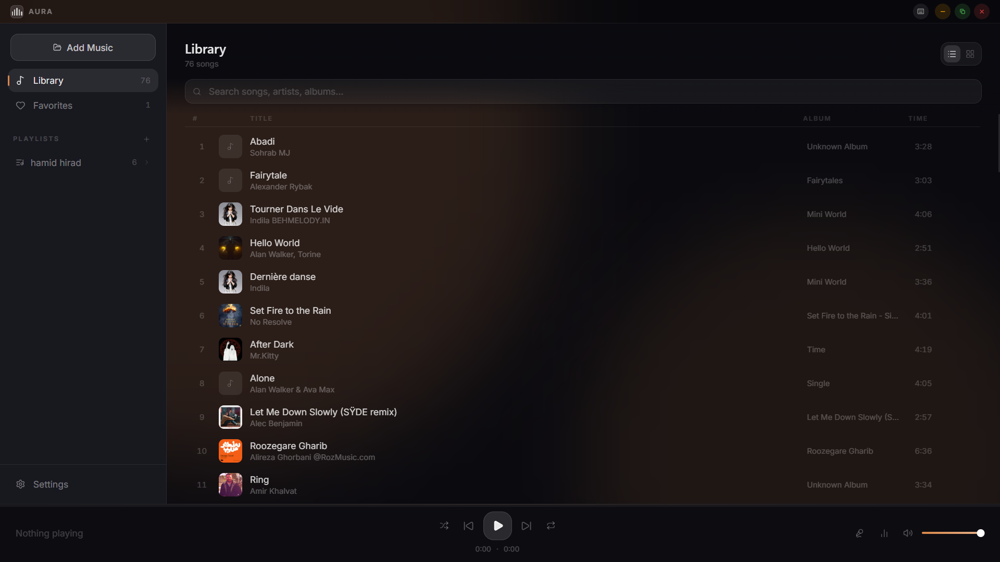
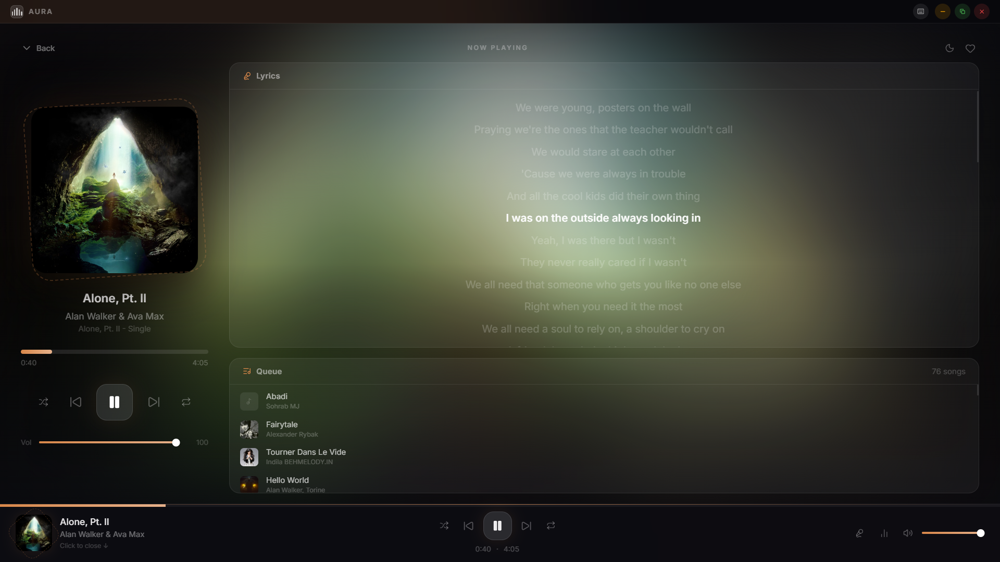
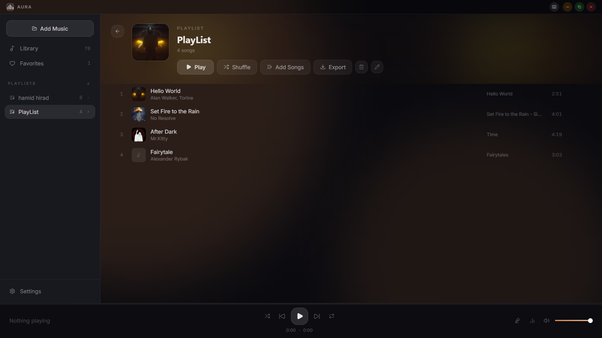
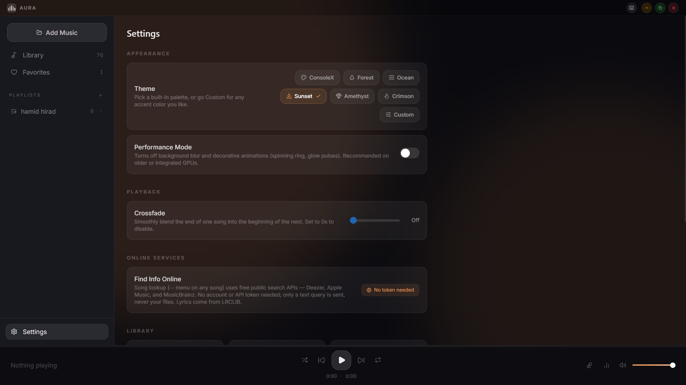
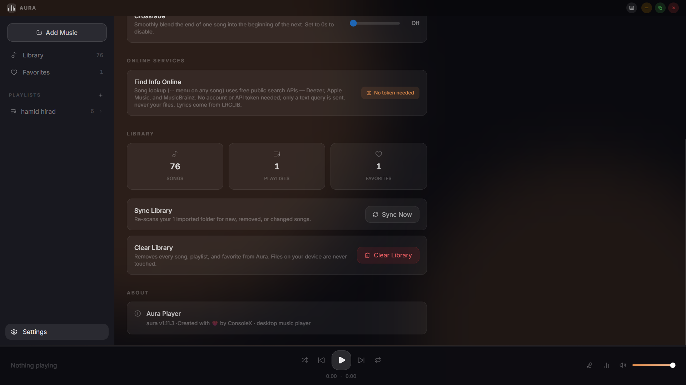

# 🎵 Aura Player

> A modern, elegant, and lightweight desktop music player built with Electron, React, TypeScript, and Vite.


---

## ✨ Overview

Aura Player is a modern desktop music player focused on performance, simplicity, and beautiful UI.

Instead of copying the look of existing players, Aura combines a premium glassmorphism interface with dynamic colors extracted from album artwork to create a unique listening experience.

---

## 🚀 Features

### 🎵 Music Library

- Import an entire music folder
- Import individual songs, one or many at once
- Folder Sync — re-scan imported folders for new, removed, or changed songs
- Automatic metadata detection
- Album artwork support
- Fast local library
- "Show in Folder" — reveal any song's file in Explorer

### ❤️ Favorites

- Mark songs as favorites
- Dedicated favorites page

### 📂 Playlists

- Create playlists
- Rename playlists
- Delete playlists
- Add songs individually, or many at once via "Add Songs"
- Remove songs
- Remove from queue (Now Playing view)
- Export as M3U — opens in VLC, Winamp, and most other media players

### 🏷 Song Properties

- "Properties" on any song's ⋯ menu — full tag details (title, artist, album, year, genre, track) plus technical file info: format, codec, size, bitrate, sample rate, channels, and full file path
- "Show in Folder" shortcut right from the dialog

### 🔍 Find Info Online (keyless)

- Find the correct info for songs whose tags are wrong or missing — "Find Info Online" in the ⋯ menu, or from the Properties dialog
- Searches **three free music databases at once — Deezer, Apple Music (iTunes), and MusicBrainz** — and merges the results into one ranked candidate list with source badges and a BEST match marker
- **No API key, no account, no audio upload** — only a plain text query ("artist + title") is sent; your files never leave the device
- Search fires automatically when the tab opens, and the title/artist fields are editable for instant retries
- Aura shows a before → after diff of the found title, artist, album, year, and genre — you tick exactly what to apply, and nothing else
- Found album art can be applied too; it's cached locally like embedded covers, so it keeps working offline

### 🎼 Lyrics

- Automatic synchronized lyrics
- Powered by LRCLIB
- Fallback when lyrics aren't available

### 🎧 Playback

- Play / Pause
- Previous / Next
- Shuffle
- Repeat
- Crossfade — smooth fade between songs, adjustable 0–12s
- Sleep Timer — auto-pause after 15/30/45/60 minutes (Now Playing view)
- Volume Control
- Seek Bar

### ⌨ Keyboard Shortcuts

Open the in-app cheat sheet anytime with the **keyboard icon** in the title bar, or by pressing **?** — no need to memorize anything.

| Key | Action |
|------|--------|
| Space | Play / Pause |
| ← | Previous Song |
| → | Next Song |
| Ctrl + ← | Seek Back 5s |
| Ctrl + → | Seek Forward 5s |
| ↑ | Volume Up |
| ↓ | Volume Down |
| L | Toggle Favorite |
| S | Toggle Shuffle |
| R | Cycle Repeat |
| M | Mute / Unmute |
| ? | Keyboard Shortcuts Guide |
| Esc | Close Panels & Dialogs |
| Scroll | Adjust Volume (over the volume control) |

### 💬 Instant Feedback (Toasts)

Every keyboard action gives visible confirmation — a small toast rises above the player bar:

- ❤️ "Added to Favorites" — with the song's title and artist, so pressing L deep in a scrolled list is never a guess
- 🔀 Shuffle on/off · 🔁 Repeat mode changes · 🔇 Mute/unmute
- ▶️ "Now Playing" card when skipping with ←/→
- 🌙 "Sleep Timer Ended" when the timer fires
- Volume changes show a compact **% pill** right above the volume slider (works for keys, scroll wheel, mute — everything)

### 🎨 UI

- Theme picker: ConsoleX (default), Forest, Ocean, Sunset, Amethyst, Crimson, or a fully Custom accent color
- Dynamic Accent Colors: your chosen theme stays consistent everywhere, except the Now Playing view, which pulls its ambient color from the current song's actual album art
- Living Background: two soft ambient light orbs drift and breathe slowly behind the interface, following the active theme color (frozen automatically in Performance Mode)
- Glassmorphism
- Album Grid View
- List View
- Search
- Smooth Animations
- Custom Accent Color
- Keyboard focus indicators throughout — fully navigable without a mouse

### ⚡ Desktop

- Native Electron application
- Registered as a Windows music player — double-click any supported audio file to open it in Aura
- Global media keys — Play/Pause/Next/Previous work even when Aura isn't focused
- Windows taskbar thumbnail controls — Previous/Play-Pause/Next from the taskbar preview
- Drag-and-drop import — drop audio files or whole folders anywhere on the window
- Fast startup
- Local music playback
- Persistent settings

---

# 🛠 Tech Stack

- Electron
- React
- TypeScript
- Vite
- Tailwind CSS v4
- Zustand
- Framer Motion
- Lucide Icons

---

# 📦 Installation

Clone the repository

```bash
git clone https://github.com/ConsoleX-ir/aura-player.git
```

Go into the project

```bash
cd aura-player
```

Install dependencies

```bash
npm install
```

Start development

```bash
npm run dev
```

---

# 🔨 Build

Create a production build

```bash
npm run build
```

Package as a Windows installer (also registers file associations)

```bash
npm run build:electron
```

The installer is optimized for size — only true runtime dependencies (`music-metadata`) ship inside the app package, since the renderer bundle is fully produced by Vite at build time. `Aura.Player.Setup-1.11.3.exe` comes out **under 100 MB**.

> v1.11.3 — Cleaned up: the optional "Identify by sound" experiment was removed — every audio-recognition API requires a personal key, and Aura stays 100% keyless. The keyless Find Info Online search (Deezer + Apple Music + MusicBrainz) with editable search terms remains the way to fix wrong tags.
>
> v1.11.0 — Phase 2 kickoff: Song Properties dialog (tags + technical file info), keyless "Find Info Online" that searches Deezer, Apple Music, and MusicBrainz (no API key, no audio upload) and lets you apply the correct metadata with a field-by-field diff, plus two slow-drifting ambient light orbs in the background.
>
> v1.10.0 — Phase 1 finale: anchored Lyrics/Visualizer popovers that open exactly on their play-bar icons, the in-app Keyboard Shortcuts guide, toast feedback for keyboard actions, mute (M), scroll-wheel volume, and a slimmed-down installer.

---

# 📁 Project Structure

```
src/
 ├── components/   # UI components, grouped by area (Sidebar, Player, Library, Modals, Toast)
 ├── hooks/        # useAudio, useLibraryImport, useLibrarySync, useLyrics, etc.
 ├── pages/        # Library, Playlist, Settings, NowPlaying
 ├── store/        # Zustand stores — playerStore (playback/library), toastStore (feedback), uiStore (help modal)
 ├── types/        # Shared TS types, incl. the ElectronAPI contract
 └── lib/          # Small shared utilities (utils.ts)

electron/
 ├── main.cjs      # Main process — window, IPC handlers, file association handling
 └── preload.cjs   # contextBridge — the only surface the renderer can reach into Node with
```

---

# 📸 Screenshots







---

# 🤝 Contributing

Contributions, ideas, and bug reports are always welcome.

Feel free to open an Issue or submit a Pull Request.

1.Arsalan Jafarnezhad : tester and feature suggester. Github: https://github.com/Arsalan-Jafarnezhad

---

# 📄 License

This project is licensed under the MIT License.

---

# 👨‍💻 Author

**ConsoleX**

Made with ❤️ and lots of music.
