# 🎵 Aura Player

> A modern, elegant, and lightweight desktop music player built with Electron, React, TypeScript, and Vite.


---

## ✨ Overview

Aura Player is a modern desktop music player focused on performance, simplicity, and beautiful UI.

Instead of copying the look of existing players, Aura combines a premium glassmorphism interface with dynamic colors extracted from album artwork to create a unique listening experience.

v3 is the liquid-glass generation. A wide glass play bar breathes with the real bass of the track, eight complete theme identities each carry their own light paper and secondary accent, the sidebar truly collapses, the Now Playing view became a stage that crossfades between synchronized lyrics and three live visualizers, and the audio engine gained an effects rack with importable presets. Your music got more personal too — custom cover art, searchable track notes, and a first launch that greets you by name. Online, Explore reads as an editorial discovery page, Radio is filtered to music, and every failure state still tells you the truth.

---

## 🚀 Features

### 🎵 Music Library

- Import an entire music folder
- Import individual songs, one or many at once
- Folder Sync — re-scan imported folders for new, removed, or changed songs
- **Folder Watching** — imported folders are watched live (fs.watch, event-driven, zero polling); the library reconciles itself automatically, toggleable in Settings
- **Library Sorting** — Recently Added, Title, Artist, Album, or Duration, each with ascending/descending order
- **Album Grid View** and fast virtualized List View
- Automatic metadata detection
- Album artwork support (embedded art cached to disk — large libraries stay light)
- **Custom cover art** — override any song's artwork with your own image from the Properties page; it is scaled to a bounded local copy (≤512px), your audio files and provider metadata are never touched, and the override shows up everywhere — play bar, Now Playing, song rows, even the Mini Player — with a one-click reset to the original
- **Track Notes** — private notes on any song, autosaved locally as you type, and searchable from the library search (free text or the dedicated `note:` operator)
- Search across songs, artists, albums, and your notes
- "Show in Folder" — reveal any song's file in Explorer

### ❤️ Favorites

- Mark songs as favorites
- Dedicated favorites page

### 📂 Playlists

- Create playlists
- Rename playlists
- Delete playlists
- Add songs individually, or many at once via "Add Songs"
- Remove songs
- Remove from queue (Now Playing view)
- Export as M3U — opens in VLC, Winamp, and most other media players
- **Searchable "Add to Playlist" picker** — stays the same size whether you have 3 or 300 playlists

### 🏷 Song Properties

- "Properties" on any song's ⋯ menu — a full Windows-Media-Player-style page: tag details (title, artist, album, year, genre, track) plus technical file info: format, codec, size, bitrate, sample rate, channels, and full file path
- "Your Listening" — per-song plays, completions, skips, total time, last played (100% local)
- **Artwork & Notes tab** — choose, replace, or reset custom cover art with a live preview and an "Override active" badge, plus the Track Note editor with debounced autosave
- "Show in Folder" shortcut right from the page

### 🔍 Find Info Online (keyless)

- Find the correct info for songs whose tags are wrong or missing — "Find Info Online" in the ⋯ menu, or from the Properties page
- Searches **three free music databases at once — Deezer, Apple Music (iTunes), and MusicBrainz** — and merges the results into one ranked candidate list with source badges and a BEST match marker
- **No API key, no account, no audio upload** — only a plain text query ("artist + title") is sent; your files never leave the device
- Search fires automatically when the tab opens, and the title/artist fields are editable for instant retries
- Aura shows a before → after diff of the found title, artist, album, year, and genre — you tick exactly what to apply, and nothing else
- Found album art can be applied too; it's cached locally like embedded covers, so it keeps working offline

### 🎼 Lyrics

- Automatic synchronized lyrics in the Now Playing view and a Lyrics popover on the play bar
- Powered by LRCLIB
- Fallback when lyrics aren't available

### 📊 Aura Rewind

- Your month, told by your own listening — a cinematic stats story computed from the 100% offline scrobble store
- Total listening time, top songs / artists / albums with animated rankings, a 24-hour listening clock, week rhythm, a day-by-day heatmap, completion donut, streaks, and unique counts
- Month stepper to travel back through your history
- Render a shareable 1200×630 image card locally — nothing is uploaded anywhere

### 🎧 Playback

- Play / Pause
- Previous / Next
- Shuffle — a real play order (the queue always shows exactly what plays next)
- Repeat (all / one)
- Crossfade — smooth fade between songs, adjustable 0–12s
- **10-band Equalizer** — 8 preset curves plus fully custom band control, persisted; flat = true bypass
- **Audio Effects** — see below
- Sleep Timer — auto-pause after 15/30/45/60 minutes (Now Playing view)
- Volume Control + scroll-wheel fine adjustment
- Seek bar with hover time labels
- **The queue survives restarts** — it persists as ID references, rebuilds against your library at launch, and Aura never autoplays on startup
- **Aura Pulse** — the play bar's aurora field breathes with the track's real low-frequency energy; rests smoothly on pause, and freezes in Performance Mode

### 🎚 Audio Effects

- Five direct controls stacked on the equalizer: **Bass, Treble, Compression, Reverb, and Stereo Width** — double-click any knob to reset it
- A real Web Audio chain behind the EQ: low shelf → high shelf → compressor → reverb (dry/wet) → mid/side stereo widener, with smooth parameter gliding
- **Honest bypass** — neutral settings remove the chain from the signal path entirely; the engine costs nothing until you use it
- The visualizer and the play bar's aurora listen **after** the effects — what you see is what you hear
- **7 built-in presets** plus your own named presets — save, apply, and delete them from Settings → Playback
- **Export / Import** your whole effects setup as a small JSON file — it carries configuration only, never processed audio, and foreign files are sanitized before anything is applied

### 🪟 Windows Integration

- **System Media Transport Controls (SMTC)** — Aura appears in Windows' native media flyout (volume overlay, Win+K, lock screen) with track title, artist, album art, and working Play/Pause/Previous/Next — including while minimized
- Global media keys — Play/Pause/Next/Previous work even when Aura isn't focused
- Windows taskbar thumbnail controls — Previous/Play-Pause/Next from the taskbar preview
- Registered as a Windows music player — double-click any supported audio file to open it in Aura
- Single-instance: double-clicking another song plays it in the existing window

### 🐧 Linux

- **AppImage and .deb** packages built from the repository (`npm run build:linux`)
- Audio file associations via the desktop entry — Aura shows up in your system's "Open with" list
- The same full app: liquid-glass UI, themes, effects, Mini Player, and first-launch flow all behave natively on Linux

### 🌐 Explore & Radio

- **Explore 3.0** — an editorial discovery page over Audius: a #1 hero card with Play-now, ranked trending rails, an "Under the Radar" grid, large online-playlist cards, and Fresh Finds — every piece plays straight into the same engine, queue, and Mini Player as your local files
- **Live Radio** (Radio Browser) — search by name, filter by country, language, or genre, ranked by community votes
- **Radio stays about the music** — stations tagged news, talk, politics, religion, sports, and similar are filtered out by their own metadata; untagged stations are kept (no evidence, no assumption), and your radio favorites are never filtered
- **Failure states that speak** — Aura distinguishes "your internet connection is down" from "this online service is currently unavailable"; timeouts, rate limits, and provider errors each get their own message and a Retry
- Offline, Explore stays useful with direct jumps into your local Library and Favorites

### ⌨ Keyboard Shortcuts

Open the in-app cheat sheet anytime with the **keyboard icon** in the title bar, or by pressing **?** — no need to memorize anything.

| Key | Action |
|------|--------|
| Space | Play / Pause |
| ← | Previous Song |
| → | Next Song |
| Ctrl + ← | Seek Back 5s |
| Ctrl + → | Seek Forward 5s |
| ↑ | Volume Up |
| ↓ | Volume Down |
| L | Toggle Favorite |
| S | Toggle Shuffle |
| R | Cycle Repeat |
| M | Mute / Unmute |
| Ctrl + K | Command Palette |
| N | Toggle Now Playing |
| Q | Queue Panel |
| P | Mini Player |
| ? | Keyboard Shortcuts Guide |
| Esc | Close Panels & Dialogs |
| Scroll | Adjust Volume (over the volume control) |

### ⌘ Command Palette (Ctrl+K)

- The whole app, one keystroke away: navigation, playback actions, playlist jumps, panel toggles, and system switches (theme, mini player, Performance Mode)
- Live library search — find a song and press Enter to play it
- Fuzzy matching with ranked results, full keyboard navigation

### 💬 Instant Feedback (Toasts)

Every keyboard action gives visible confirmation — a small toast rises above the player bar:

- ❤️ "Added to Favorites" — with the song's title and artist, so pressing L deep in a scrolled list is never a guess
- 🔀 Shuffle on/off · 🔁 Repeat mode changes · 🔇 Mute/unmute
- ▶️ "Now Playing" card when skipping with ←/→
- 🌙 "Sleep Timer Ended" when the timer fires
- 📚 "Library synced" when Folder Watching picks up changes
- Volume changes show a compact **% pill** right above the volume slider (works for keys, scroll wheel, mute — everything)

### 🎨 UI

- **Eight theme identities** — ConsoleX, Ocean Deep, Amethyst, Cyan Frost, Emerald, Crimson, Amber, and Mono — each remapping the entire palette (ink scale, ambient clouds, and a curated secondary accent) and carrying its own light "paper" for light mode; a fully Custom accent color is still available; every switch crossfades
- **Liquid-glass play bar** — a wide glass slab (no more pill) with a top sheen, an accent-tinted hairline border, and a two-layer aurora field that breathes with the track's real bass; still when paused, calm in Performance Mode and reduced-motion
- **Collapsible sidebar** — the floating glass card folds from 246px to a 56px icon rail and back, remembers its state across restarts, and keeps every destination reachable
- **Now Playing stage** — one quiet segmented toggle crossfades between synchronized **Lyrics** and a full-size **Visualizer** (Aurora, Particles, or Radial) on a single efficient canvas that only animates while music plays
- **Mini Player 3.0** — the independent desktop widget now inherits your theme and accent (artwork-aware on Now Playing), shows an honest "up next" preview on hover, and keeps its full draggable, always-on-top lifecycle
- **A first launch that greets you** — an optional display name (never an account, never sent anywhere), a time-of-day "welcome back" greeting in the Library, and an honest "make Aura your default player" offer that opens your OS settings — no registry hacks, no fake success
- **Dark & Light themes** — dark is Aura's true form; light is a designed, glow-first paper look with an animated cross-fade between them
- Dynamic Accent Colors: your chosen theme stays consistent everywhere, except the Now Playing view, which pulls its ambient color from the current song's actual album art
- Living Background: soft ambient light behind the interface, following the active theme (frozen automatically in Performance Mode)
- Glassmorphism with depth — layered translucency, soft shadows, refined hover and press states everywhere (never a layout shift)
- Smooth animations — transform/opacity only, GPU-friendly, all of it disabled under Performance Mode or reduced-motion
- Keyboard focus indicators throughout — fully navigable without a mouse

### ⚡ Desktop

- Native Electron application
- Drag-and-drop import — drop audio files or whole folders anywhere on the window
- Fast startup — lazy-loaded pages, virtualized lists, IndexedDB-backed library
- Local music playback
- Persistent settings, library, queue, and last-played state
- **Performance Mode** — one toggle strips blur and decorative animation for weak GPUs

---

# 🛠 Tech Stack

- Electron
- React
- TypeScript
- Vite
- Tailwind CSS v4
- Zustand
- Framer Motion
- Lucide Icons

---

# 📦 Installation

Clone the repository

```bash
git clone https://github.com/ConsoleX-ir/aura-player.git
```

Go into the project

```bash
cd aura-player
```

Install dependencies

```bash
npm install
```

Start development

```bash
npm run dev
```

---

# 🔨 Build

Create a production build

```bash
npm run build
```

Package as a Windows installer (also registers file associations)

```bash
npm run build:electron
```

Package for Linux — builds an **AppImage** and a **.deb** (targets defined in `package.json`)

```bash
npm run build:linux
```

The packages are optimized for size — only true runtime dependencies (`music-metadata`) ship inside the app package, the renderer bundle is fully produced by Vite at build time, and every non-English Electron locale is stripped from the package (about 46 MB lighter unpacked) while keeping full functionality. The Windows installer comes out **around 80 MB**; the Linux AppImage and .deb land **around 90 MB** each.

---

# 🕘 Version History

> v3.0.0 — **The liquid-glass generation.** The largest design wave since v2. **Theme System 3.0**: eight complete identities — ConsoleX, Ocean Deep, Amethyst, Cyan Frost, Emerald, Crimson, Amber, Mono — each remapping the whole token cascade (ink scale, ambient clouds, secondary accent) with its own light paper, animated switching, and zero new dependencies; the primary accent stays on the artwork-driven pipeline. **Playbar 3.0**: the capsule became a wide liquid-glass slab with a top sheen, an accent-tinted hairline, and a two-layer aurora (field + specular rim) that breathes with real bass from the analyser and rests when paused. **Sidebar 3.0**: true collapse to a 56px icon rail, persisted across restarts, with one unified selection language and the nested-selection quirk fixed. **Now Playing stage**: a quiet LYRICS | VISUALIZER toggle crossfades into a single-canvas visualizer with three honest modes (Aurora, Particles, Radial) that only animates while music plays. **Mini Player 3.0**: the widget inherits your theme and resolved accent, previews what plays next on hover, and keeps its whole desktop lifecycle. **Explore 3.0**: an editorial composition layer — hero card, ranked rails, Underground grid, large playlist cards — with the hardened networking layer untouched, and Radio now filtered to music by station metadata (untagged stations kept, favorites never filtered). **Audio Effects**: a real five-knob chain (bass, treble, compression, reverb, stereo width) with neutral = true bypass, 7 built-in presets, user presets, and JSON export/import (configuration only, never processed audio). **Your music, more yours**: custom cover art (bounded local override, propagated everywhere, non-destructive) and searchable Track Notes. **First launch**: an optional name, a "Good morning — welcome back" greeting, and an honest default-player offer that hands off to your OS. Two real bugs found by the release audit were fixed: Find Info Online had been silently broken by a swallowed reference error (now fixed and verified against the live sources), and the Properties page could crash on partial file stats. Measured at a 5,000-song scale, all 15 performance budgets hold — first library row ~0.9s, worst navigation settle 50ms, zero heap growth — and the full regression battery (20 runtime + 17 unit suites) runs green. Linux packaging (AppImage + .deb) ships from the project's own build config.

> v2.16.1 — **The network honesty wave.** Provider failures now speak their true kind: typed errors end every failover path, so a host fallback that exhausts its list reports "this service is unreachable" instead of pretending to be offline, a 403 is never relabeled as "no network", and a provider dying mid-request can never come back as "no results". Every Audius and Radio Browser call now runs a host failover across backup endpoints with per-attempt timeouts, retry/after handling and request cancellation preserved, and an on-demand diagnostic probe that reports what it actually measured (latency, error kind, detail) instead of swallowing the exception. The result: the Radio page's intermittent network errors became named, honest, recoverable states.

> v2.16.0 — **Performance & Scale pass.** A dedicated audit-and-measure sweep over the whole app, ending in a permanent 15-budget performance probe (`p15_perf_probe.py`) that runs a seeded **5,000-song library + 5,000-session history** through startup, every lazy-view navigation, deep-scroll, search, rapid queue storms, long-task counts, and heap-stability holds. Measured: first library row paints in **~0.7s** with 5,000 tracks resident, worst lazy-view navigation settle **≤ 50ms**, deep-scroll to row 5,000 **≤ 50ms**, 60 instant queue skips in **~140ms**, and **zero measurable heap growth**. Audit fixes: the visualizer's wave mode no longer allocates a fresh 2KB buffer every frame, and the mini-player heartbeat no longer ships identical snapshots 4×/s — a paused widget now costs zero IPC pushes and zero re-renders. Full functional + unit regression battery green; zero new dependencies.

> v2.15.0 — **Ambient Visuals, now truly optional.** The ambient system (artwork-tinted background orbs, Aura Pulse ring, dynamic per-view color) was audited against its contract: it never touches your chosen theme or accent — it drives a separate ambient variable family that reverts to your theme the moment you leave Now Playing, falls back gracefully when artwork fails to decode, respects Performance Mode and prefers-reduced-motion. What was missing was the OFF switch: **Settings → Ambient Visuals** now removes the orbs and pulse motion entirely for a completely still interface, persists across restarts.

> v2.14.0 — **Mini Player, desktop-grade.** The independent desktop widget keeps its full lifecycle — auto-appears on minimize, floats and drags anywhere without stealing focus, its close button hides only itself, it dies with the app — and now **remembers where you put it**: position persists across restarts, sanity-checked against connected displays so a monitor unplugged since last session can never leave the widget stranded off-screen. Verified end-to-end in real Electron.

> v2.13.0 — **Playback Experience 2.0 — the keyboard, fully audited.** A complete routing audit of every key that reaches the app: **Space on a focused button** no longer double-fires, **arrow keys inside open menus** no longer skip tracks, and the volume-vs-seek slider fix is kept and broadened. Everything else verified working: L/S/R/M/N/Q/P shortcuts, Ctrl+K everywhere, input typing immunity, Ctrl+Arrows seek, shuffle restore, repeat cycling, volume steps with OSD, crossfade, sleep timer, and SMTC/global media keys riding the same playback funnel.

> v2.12.0 — **Queue 2.0.** Reorder upcoming tracks, Play now on any row, Clear upcoming with one click, and Play Next / Add to Queue from every song's ⋯ menu — manual actions always outrank Smart Queue. **The queue survives restarts**: it persists as ID references, is rebuilt against your library at launch, the playhead is restored consistently, and Aura never autoplays on startup.

> v2.11.0 — **Listening History.** A full chronological record of everything you have played, virtualized so **2,500+ sessions stay smooth**, with substring search, completed/skipped filters, time ranges, and a stats strip (sessions, unique songs, completion rate, total listening time). Deleted songs stay visible in history, marked inert.

> v2.10.0 — **Artist & Album pages.** Real destinations, not just rows: artwork mosaics, album pages, Start Radio from any artist, Related in your library, Go to Artist / Go to Album in every ⋯ menu. Everything clearly badged Local — Explore remains the online surface.

> v2.9.0 — **Smart Queue & Smart Playlists.** As the queue runs dry, Aura quietly appends on-device recommendations seeded by what is playing — append-only, badged with reasons. Made for You, Discovery, and Favorites Radio: deterministic on-device lists that show WHY every track was picked.

> v2.8.0 — **Smart Music Engine.** A local-first, purely algorithmic recommendation engine — no AI, no network, fully explainable. Every pick carries human-readable reasons from real local signals: artist/genre/album/era similarity, play counts, completion rates, skip aversion, favorites, recency decay, and hour-of-day context. Start Radio on any song; "Play something for me" in the palette.

> v2.7.0 — **Explore, complete.** Trending, Fresh this week, Under the Radar, Online Playlists, and a Feeling Lucky button. Search covers tracks, artists, and playlists at once — and stays honest: an error is only shown when the provider is truly unreachable.

> v2.6.0 — **Live Radio, worldwide.** A Radio tab powered by Radio Browser: search by name, filter by country/language/genre with live facets, live streams through the same engine (no seeking on live — on purpose), dead stations filtered before they reach the list, persisted radio favorites, and play pings back to the directory as good citizenship. Keyless, nothing to configure.

> v2.5.0 — **Audius is here: free streaming, keyless.** Trending and Under the Radar on open; search finds tracks and artists; online tracks ride the exact same engine, queue, mini player, visualizer, and media keys as your files. Offline detection by real probe, timeouts, rate limits and provider errors each get their own message and a Retry. Nothing is faked; your library stays 100% local.

> v2.4.0 — **Online Provider Core.** Every network call runs through one hardened layer in the main process — hard timeouts, retries with backoff, rate-limit awareness (429 + Retry-After), response validation, a small TTL cache, and cancellation. The renderer names a provider and an operation (allowlisted); it can never fetch a URL directly.

> v2.3.0 — **Search & Navigation 2.0.** One search engine everywhere: shared parser, field operators, and fuzzy matcher between library search and Ctrl+K. Typo-friendly close matches (operators stay literal), search hand-off from palette to library, focusable library rows, and a loop-guard on unplayable files.

> v2.2.0 — **Library 2.0.** Library Health verifies every entry against disk (missing, unreadable, duplicates) with one-click cleanup. Listen-stats sorting, advanced field operators, genre filter, a richer library overview, and playback errors that name themselves in a toast.

> v2.1.2 — Playlist menus that scale (searchable picker), a true always-on-top desktop Mini Player (P), keyboard routing that respects focus, and a menu-glitch sweep.

> v2.1.1 — The stability wave: intentional deletions stay deleted (tombstones), view/sort preferences persist, coordinated-shutdown flush, removing the playing song actually stops the audio, and a pre-hydration write gate protects the library snapshot.

> v2.1.0 — Floating glass sidebar, Windows SMTC (native media flyout + global media keys), Library sort menu, light-theme lyrics fix, a wider glassier play bar, deep render-loop optimizations, and a 202-check regression battery.

> v2.0.0 — The milestone. **Aura Rewind** (cinematic monthly story + shareable card), **Ctrl+K command palette**, mini-player mode, event-driven **folder watching**, **light mode** with animated cross-fade, and the living pill play bar.

> v1.11.6 — Calmer background: the drifting light-orb motion is gone; playlist glow takes its color from the playlist's cover image.

> v1.11.5 — Queue panel fix: the Now Playing queue reads top-to-bottom in true playback order.

> v1.11.4 — The ambient background orbs got brighter, bigger, and sweep visibly across the window.

> v1.11.3 — The "Identify by sound" experiment removed — Aura stays 100% keyless.

> v1.11.0 — Song Properties dialog, keyless Find Info Online (Deezer + Apple Music + MusicBrainz), and the ambient light orbs.

> v1.10.0 — Phase 1 finale: anchored Lyrics/Visualizer popovers, the Keyboard Shortcuts guide, toast feedback, mute (M), scroll-wheel volume, and a slimmed-down installer.

---

# 📁 Project Structure

```
src/
 ├── components/   # UI components, grouped by area (Sidebar, Player, Library, NowPlaying, Explore,
 │                 #   Properties, Settings, Modals, Toast, States, FirstLaunch, CommandPalette)
 ├── hooks/        # useAudio, useLibraryImport, useLyrics, useMediaKeys, useFolderWatcher, useStoreHydration, ...
 ├── pages/        # Library, Explore, Playlist, NowPlaying, Settings, PropertiesPage, RewindPage,
 │                 #   HistoryPage, SmartPlaylists, ArtistPage, AlbumPage
 ├── store/        # Zustand stores — playerStore (playback/library/queue), toastStore, uiStore, radioStore
 │                 #   + domain stores: notesStore, artworkStore, userPrefsStore (separately persisted)
 ├── styles/       # tokens.css (design tokens) + themes.css (8 theme identities)
 ├── types/        # Shared TS types, incl. the ElectronAPI contract
 └── lib/          # Pure modules — playbackController (audio engine + FX chain), queueEngine, sort, eq,
                   #   audioFx, radioMusic, search, smartEngine, smartQueue, rewind, scrobbleStore, ...

electron/
 ├── main.cjs      # Main process — window, IPC handlers, fs watchers, file associations,
 │                 #   default-player OS handoff, coordinated shutdown
 ├── findinfo.cjs  # Keyless metadata lookup (Deezer / iTunes / MusicBrainz), scored + merged
 └── preload.cjs   # contextBridge — the only surface the renderer can reach into Node with
```

---

# 📸 Screenshots

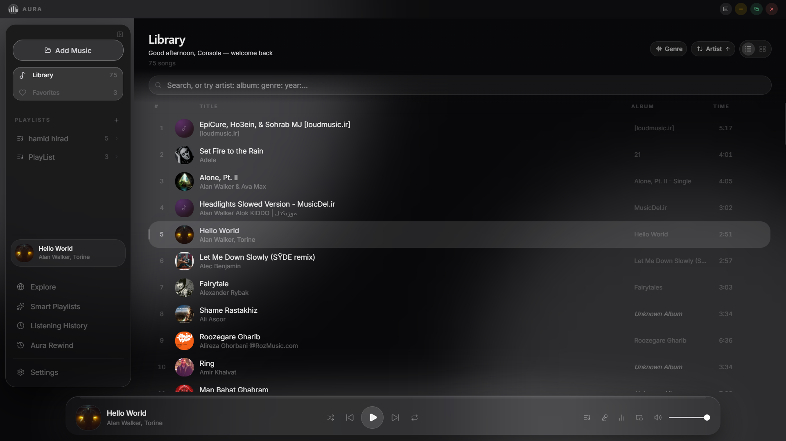

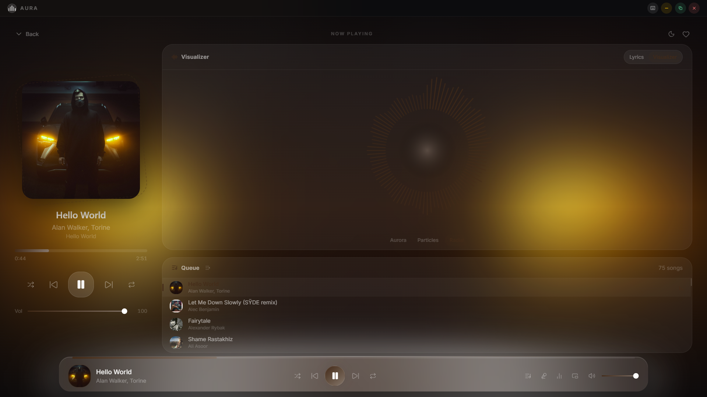
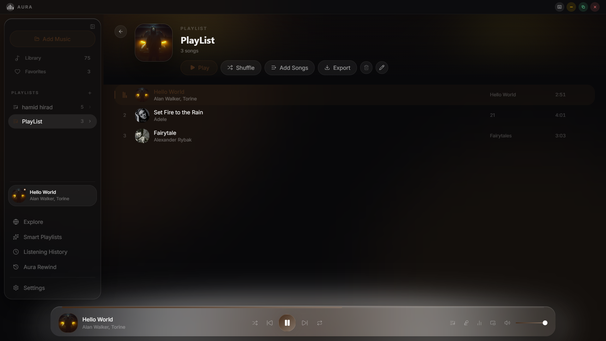
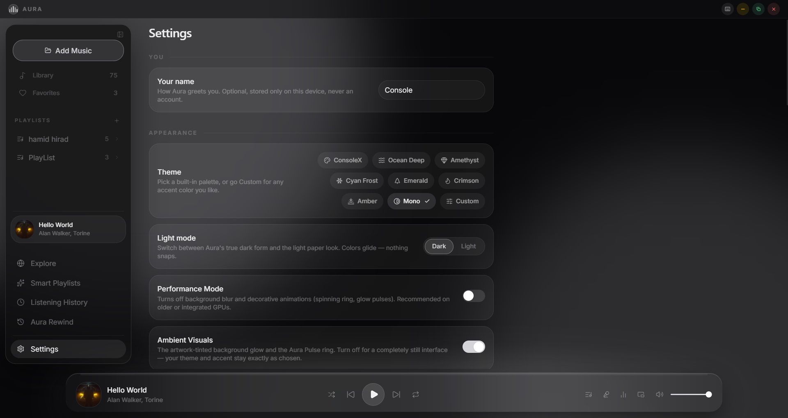
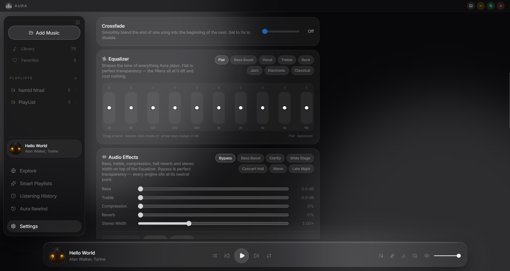
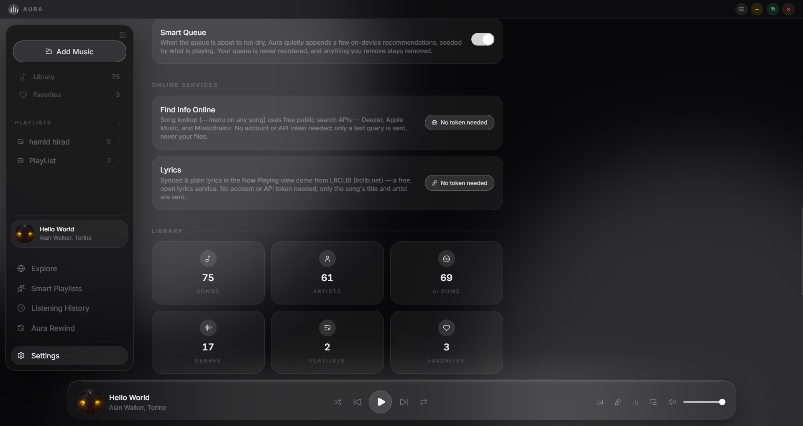
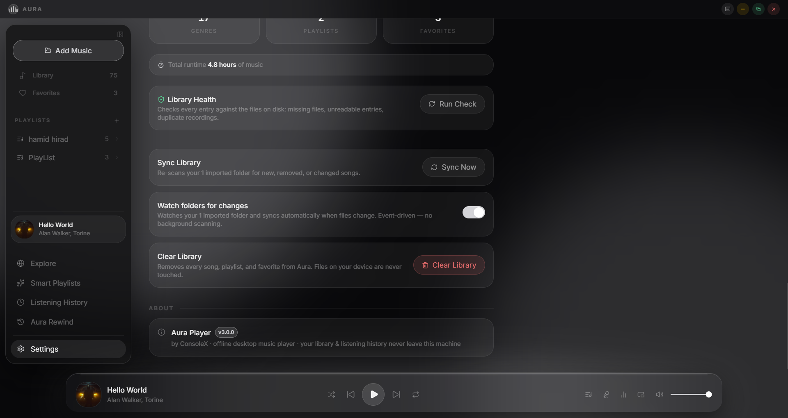

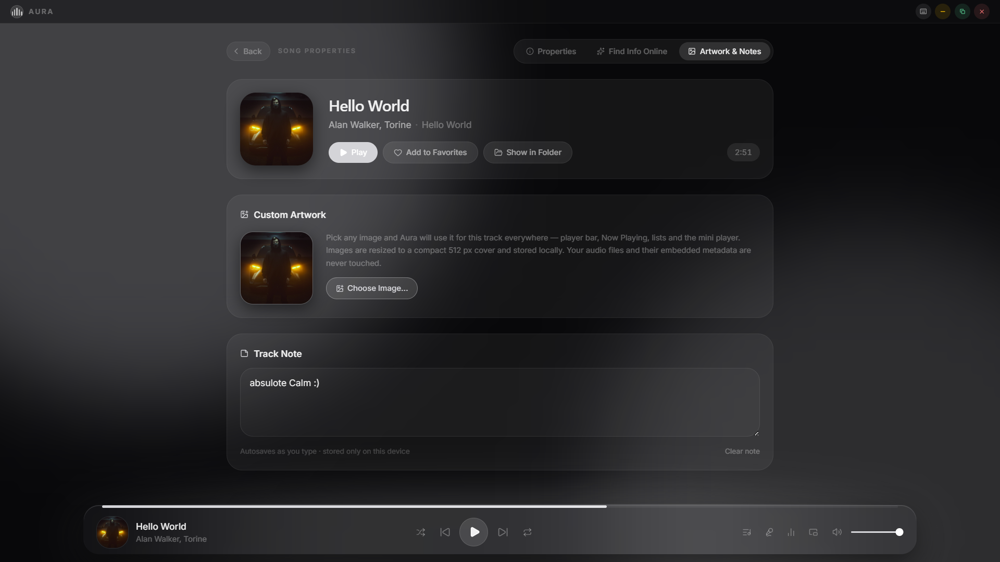
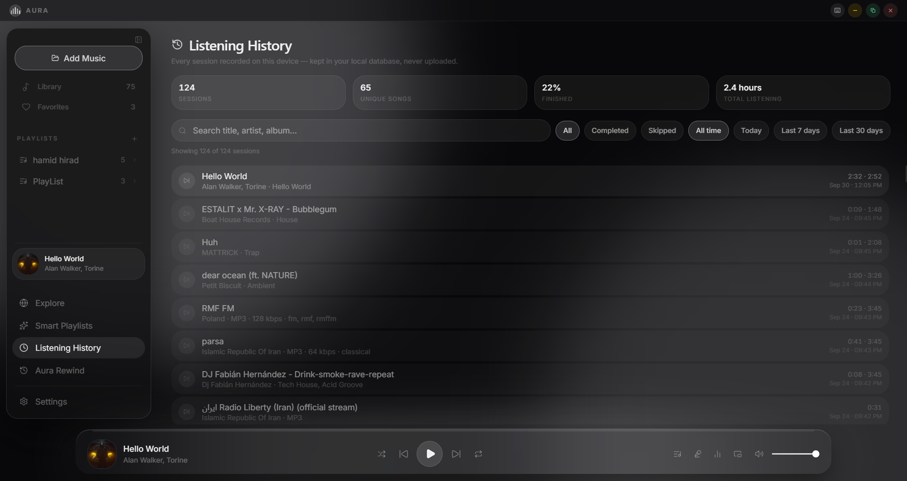
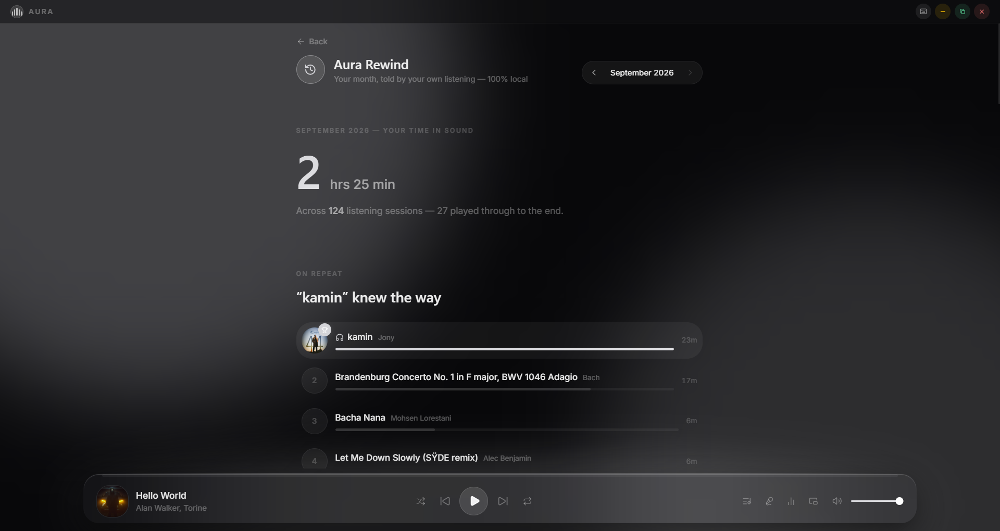
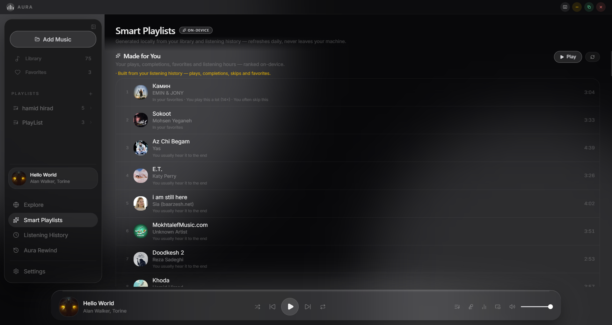
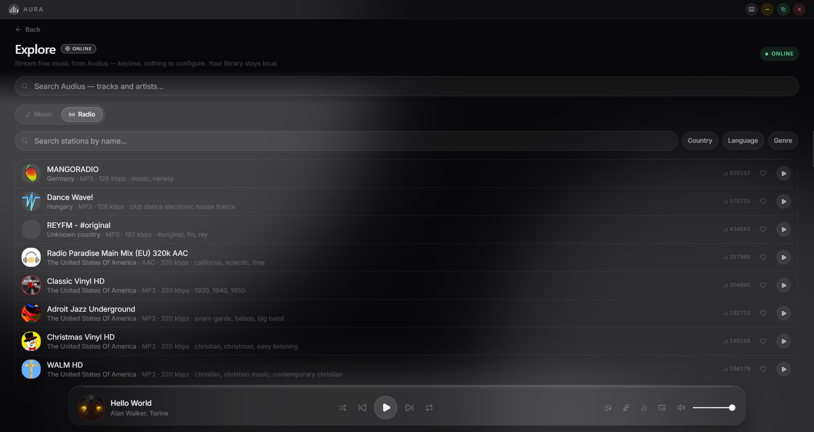
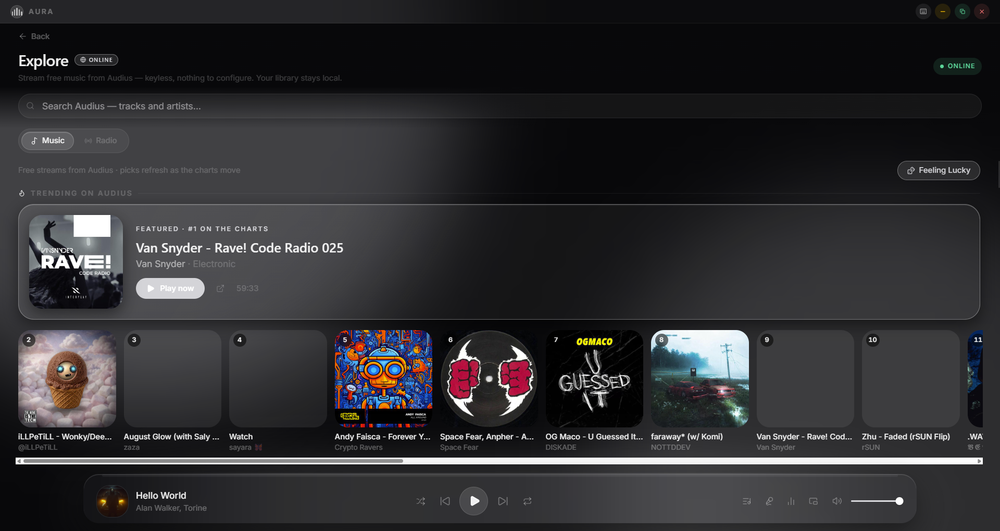


---

# 🤝 Contributing

Contributions, ideas, and bug reports are always welcome.

Feel free to open an Issue or submit a Pull Request.

1.Arsalan Jafarnezhad : tester and feature suggester. Github: https://github.com/Arsalan-Jafarnezhad

---

# 📄 License

This project is licensed under the MIT License.

---

# 👨‍💻 Author

**ConsoleX**

Made with ❤️ and lots of music.
